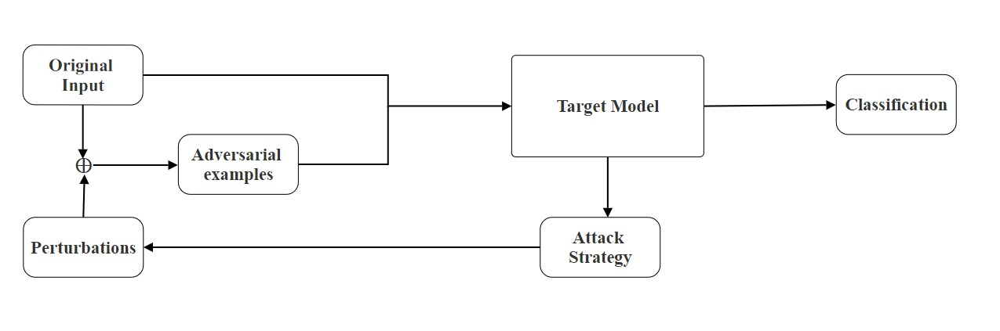

#  Fortifying Deep Learning Models Against Adversarial Threats using Adversarial Training

This project implements adversarial training to strengthen the robustness of deep learning models against adversarial attacks such as FGSM, PGD, and CW. The approach is applied to a lung CT scan classification problem using the IQ-OTH/NCCD dataset, aiming to classify images as Normal, Benign, or Malignant.

---

##  Motivation

Deep learning models have achieved remarkable accuracy in domains such as healthcare, autonomous systems, and cybersecurity. However, these models are vulnerable to **adversarial examples** — small perturbations that cause high-confidence misclassifications.

To address this vulnerability, **adversarial training** is implemented, where models are trained on both clean and adversarially perturbed data, increasing their resilience in real-world deployments.

---

##  System Overview

<p align="center">
  
</p>

---

##  Project Structure

Fortifying-Adversarial-Robustness/
├── data/ 
│ └── README.md # Instructions to download IQ-OTH/NCCD dataset
├── notebooks/
│ └── mini_final_4.ipynb 
├── paper/
│ └── Fortifying_Deep_Learning_Models_Against_Adversarial_Threats.pdf
├── requirements.txt 
├── README.md 
└── LICENSE 


---

##  Dataset

- **Dataset**: [IQ-OTH/NCCD Lung Cancer Dataset](https://www.kaggle.com/datasets/hamdallak/the-iqothnccd-lung-cancer-dataset)
- **Images**: 1,094 grayscale CT scans
- **Classes**: `Normal`, `Benign`, `Malignant`

>  **Note**: Due to Kaggle licensing, the dataset is **not included**. Please follow instructions in `data/README.md` to download and extract the dataset.
 

##  Setup Instructions

###  Python Dependencies

Create a virtual environment and install the dependencies:

```bash
pip install -r requirements.txt

